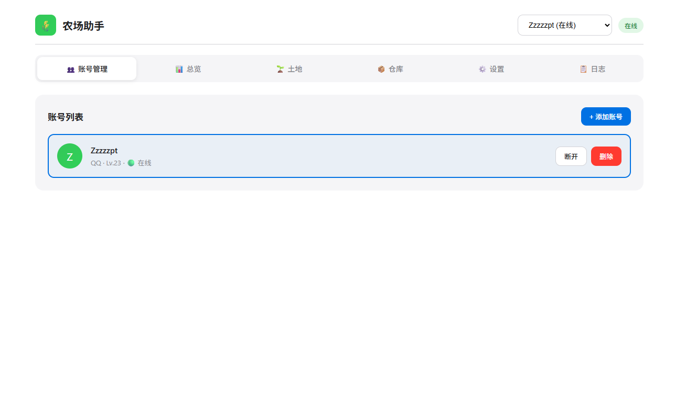
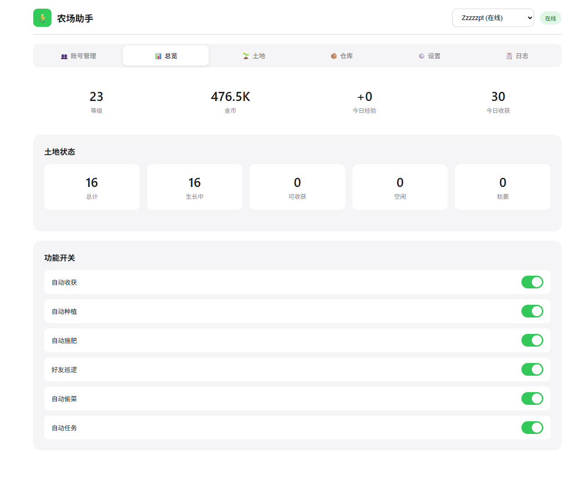
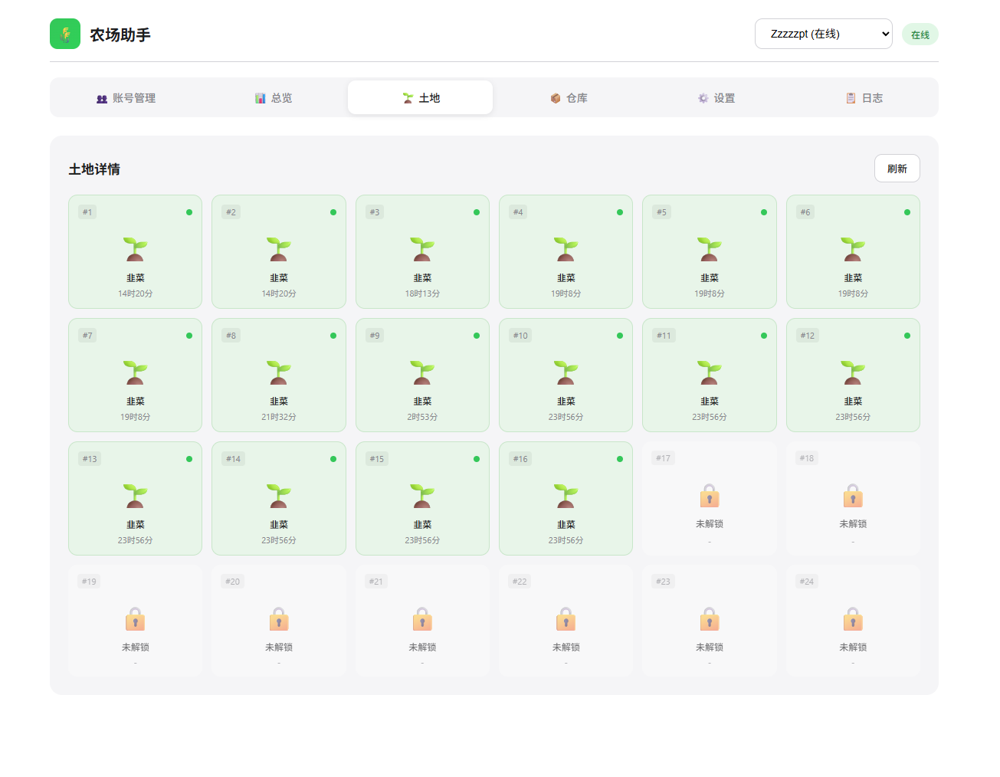
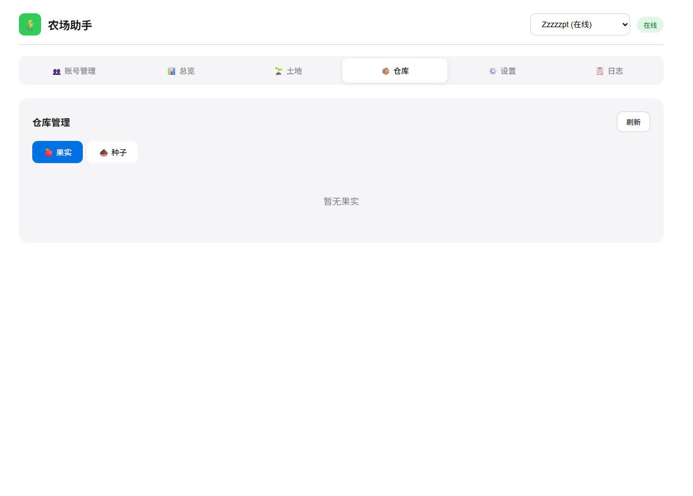
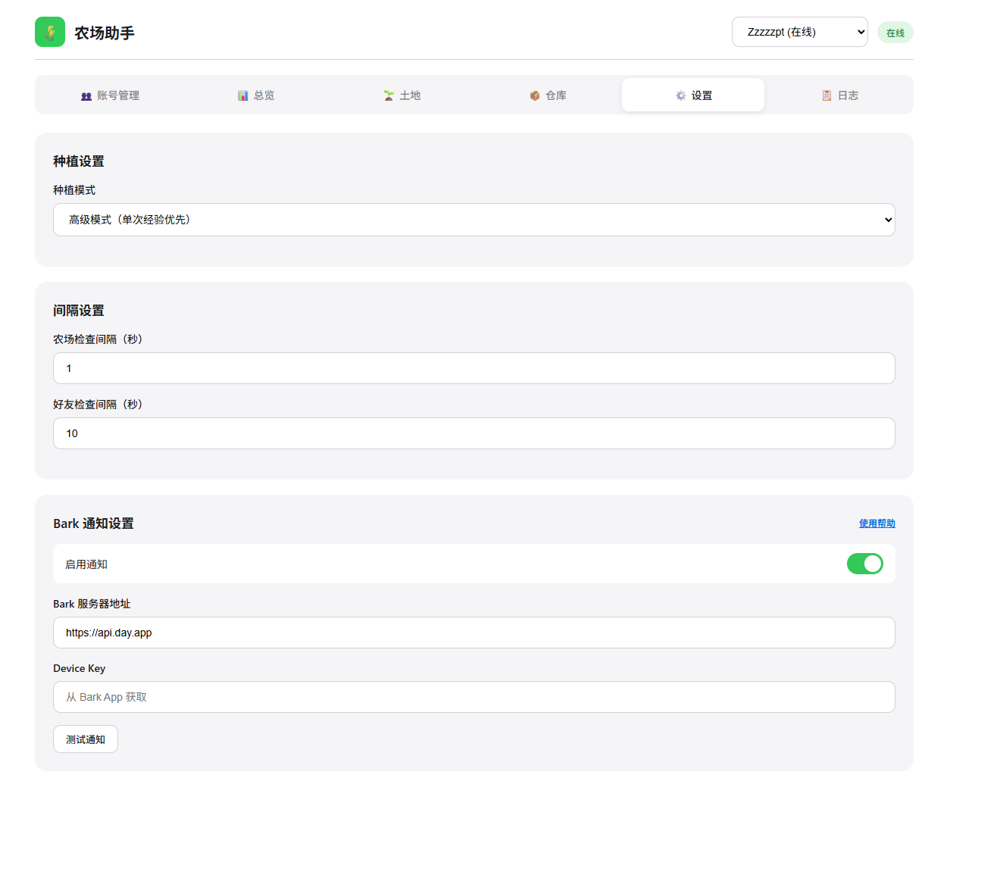
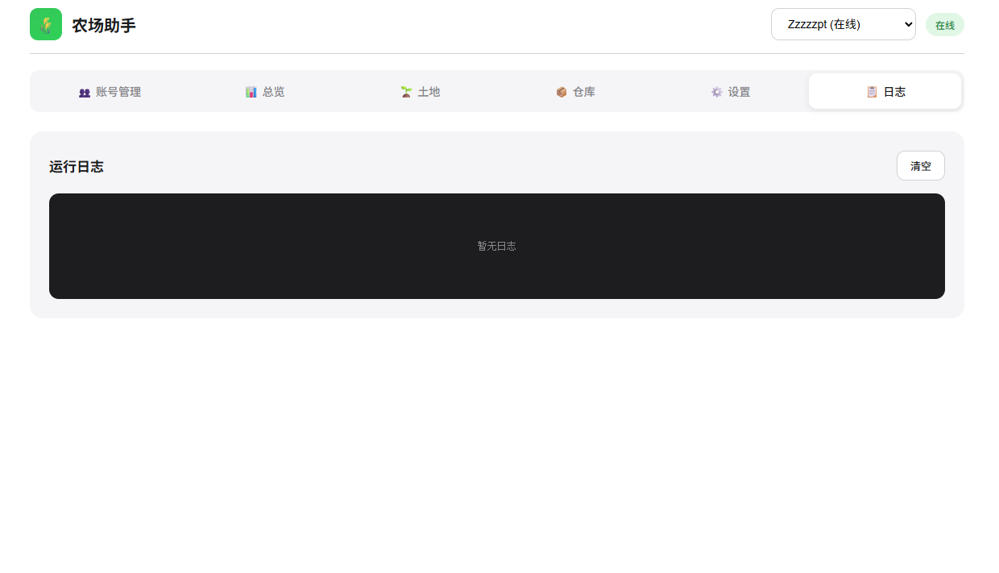

本工具仅供学习和开发测试使用，请勿用于非法用途。

本项目ai开发，bug很多可以提issue，我会尽快修复。最好点个star
# QQ 经典农场助手

一个智能化的 QQ 经典农场托管工具，支持自动收菜、种植、巡田等功能。

## 功能特性

- 🤖 **自动农场管理**
  - 自动收获成熟作物
  - 自动购买种子并种植
  - 自动施肥、除草、除虫、浇水
  - 自动铲除枯死作物

- 👥 **好友互动**
  - 自动巡查好友农场
  - 自动偷菜
  - 帮助好友除草浇水

- 📋 **任务与仓库**
  - 自动领取任务奖励
  - 自动出售仓库果实
  - 仓库管理功能

- 🎯 **种植策略**
  - 经验效率最优（默认）
  - 高级作物优先
  - 手动选择种子

- 📱 **多账号管理**
  - 支持多账号切换
  - 独立配置管理

- 🔔 **通知功能**
  - Bark 推送通知
  - 实时状态提醒

- 🖥️ **多平台支持**
  - Docker 部署（x86/amd64）
  - Docker ARM64 部署
  - 土地详情查看

### 环境要求

- Docker
- Docker Compose

### 使用镜像（推荐）

下载整个项目，运行以下命令启动容器：

```bash
docker-compose up -d
```
arm版本将docker-compose.yml中的image改为qt0361/qq-farm-bot:arm64
### 访问控制面板

打开浏览器访问：

```
http://localhost:3000
```

## 注意事项

1. **安全性**: 使用扫码登录，无需输入 QQ 密码
2. **稳定性**: 支持断线重连和自动恢复
3. **持久化**: 配置和数据保存在 `data/` 目录

## 界面预览








## 许可证

MIT License
## 致谢

本项目基于 https://github.com/QianChenJun/qq-farm-bot 添加docker
扫码功能-https://github.com/lkeme/QRLib
